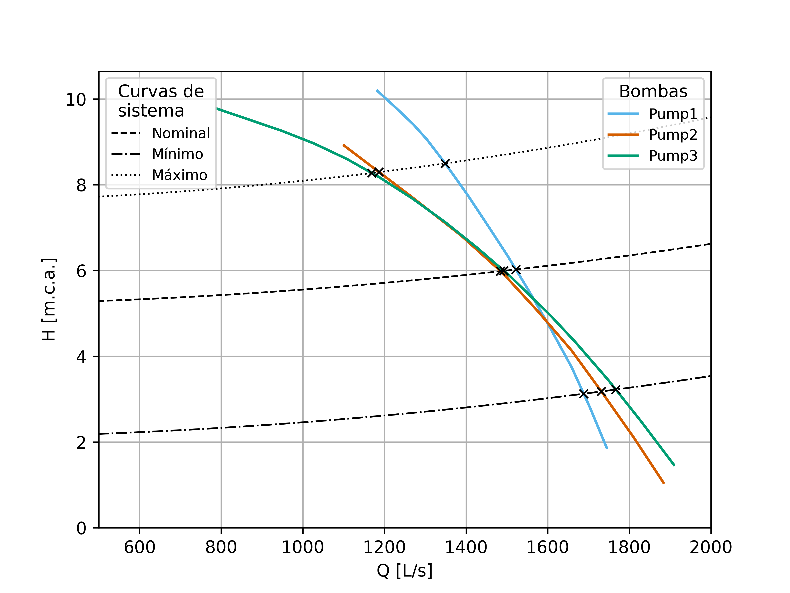

# Curvas de bombas e pontos de operação

**Português** | [English](README.en.md)

Utilitário básico. Cruzar as curvas de algumas bombas candidatas com as curvas
de sistema (nominal, mínima e máxima) e montar a tabela e o gráfico dos pontos
de operação é uma tarefa frequente no dia a dia de projeto. Este script não
faz nada além disso: **padroniza essa tarefa** para que o resultado saia
sempre no mesmo formato, sem refazer planilha a cada estudo.



## Executar

Requer o [Anaconda](https://www.anaconda.com/download) ou o [Miniconda](https://docs.conda.io/projects/miniconda/). Abra o **Anaconda Prompt** pelo menu Iniciar,
entre nesta pasta (`cd /d "caminho\desta\pasta"`) e execute os comandos abaixo.
O primeiro só é necessário na primeira vez:

```bat
conda env create -f environment.yml
conda activate curvas-bombas
python main.py
```

A tabela aparece no terminal e é gravada em `outputs/intersecoes.csv`. O
gráfico é gravado em `outputs/curvas_bombas.png`.

## Como usar com seus dados

- **Bombas:** um CSV por bomba em `curvas_bombas/`, com as colunas `Q` (L/s),
  `H` (m), `Eta1` (%) e `NPSH` (m). É o formato exportado pelo
  [Extrator de Curvas](../extrator-de-curvas/README.md). Registre cada arquivo
  no dicionário `pump_files` do `main.py`.
- **Sistemas:** edite a lista `systems` no `main.py`. Cada curva é definida
  pelo desnível geométrico `dG` e pela altura manométrica `AMT` na vazão
  nominal `Qnom`:

  ```text
  H_sistema(Q) = dG + (AMT − dG) · (Q / Qnom)²
  ```

## O que o script calcula

Para cada par bomba × sistema, o script:

1. localiza o cruzamento entre as curvas;
2. calcula a vazão e a altura do ponto de operação;
3. interpola o rendimento e o NPSH requerido nesse ponto.

A coluna `Encontrado` indica se houve cruzamento, e a coluna `Obs` registra
casos ambíguos.

Limites conhecidos, coerentes com o propósito de utilitário:

- o cruzamento é resolvido por segmentos entre pontos do CSV, então a precisão
  depende do espaçamento dos pontos;
- não há extrapolação além da faixa de vazão da curva;
- havendo mais de um cruzamento, vale o primeiro, com aviso;
- lacunas no CSV (por exemplo, NPSH não informado) viram células vazias na
  tabela;
- o NPSH disponível (`NPSHd`) é apenas registrado; a verificação de cavitação
  fica com o [Seletor de bombas](../seletor-bombas/README.md).

## Estrutura

```text
main.py             configuração e execução
pump_intersect.py   curvas, cruzamentos e tabela
pump_plot.py        gráfico
curvas_bombas/      um CSV por bomba
outputs/            tabela e gráfico do exemplo
```

As curvas do exemplo são identificadas apenas como Pump1, Pump2 e Pump3.

Licença: [MIT](LICENSE).
