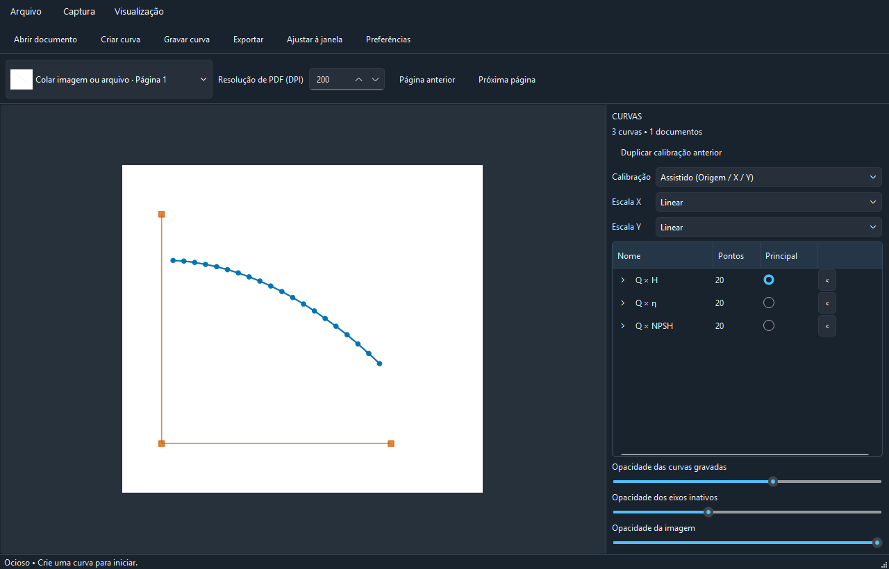
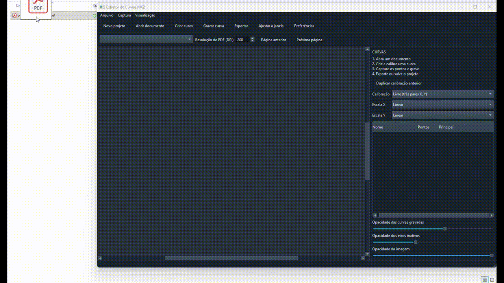
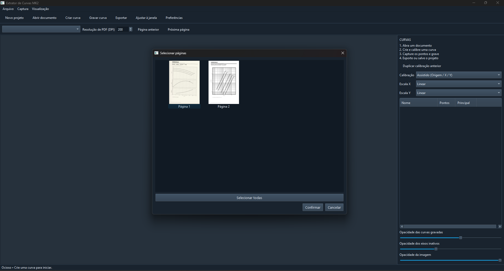
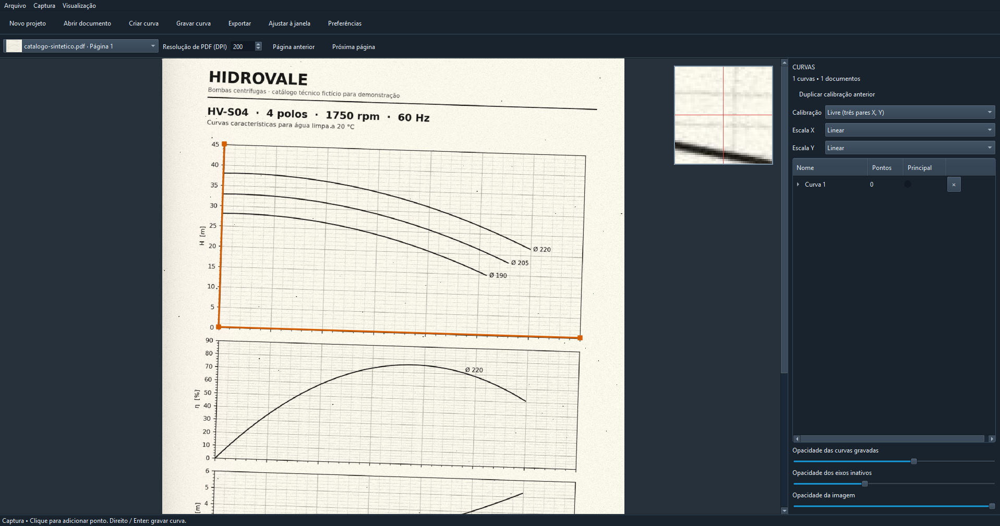
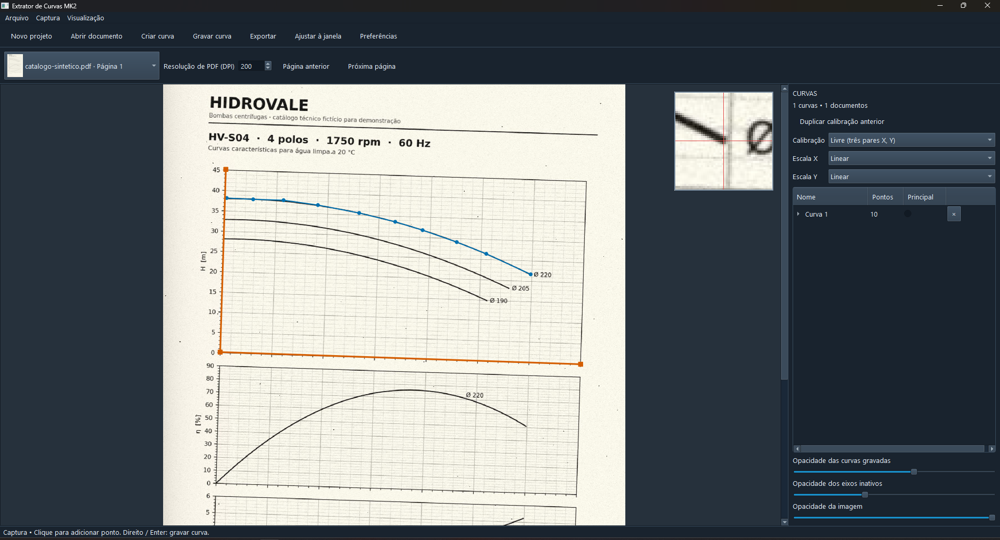
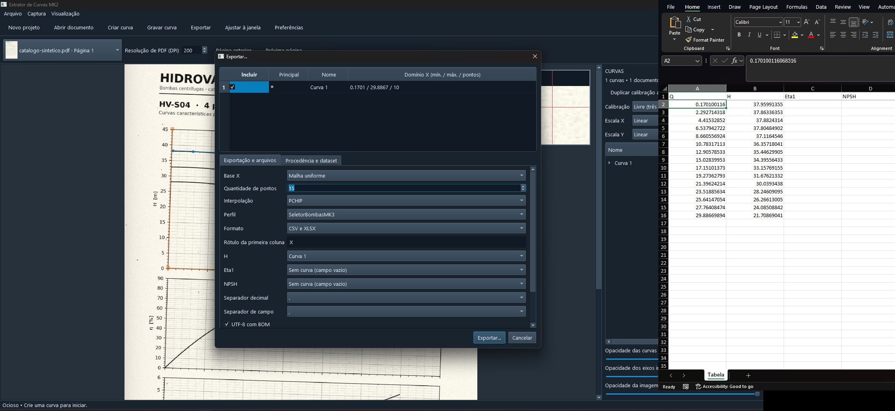
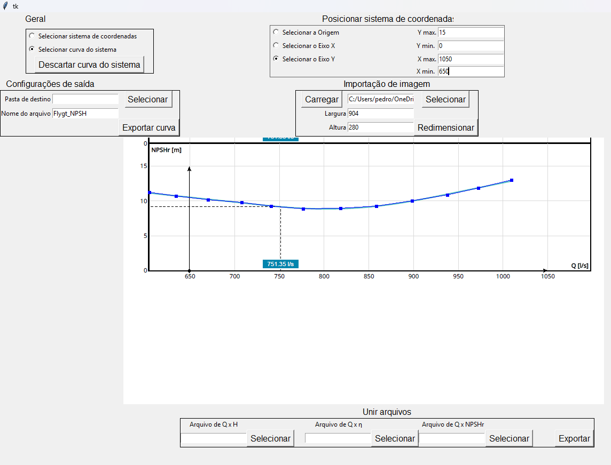

# Extrator de Curvas MK2

**Português** | [English](README.en.md)

Curvas de bomba, de ventilador ou de perda de carga quase sempre chegam como
gráfico: um PDF de catálogo ou uma imagem escaneada. Para usar esses dados em
um cálculo, alguém precisa lê-los ponto a ponto na tela e digitá-los. Este
aplicativo faz essa leitura. Você calibra os eixos, clica sobre a curva e
recebe os pontos em coordenadas de engenharia, prontos para CSV ou Excel.





## Baixar e usar (Windows)

Não é preciso instalar Python.

1. Baixe `ExtratorDeCurvasMK2-v1.0.0-windows-x64.zip` na página de
   [Releases](https://github.com/PedroMombach/portfolio-engenharia/releases)
   do repositório.
2. Extraia a pasta inteira em um local onde você tenha permissão de escrita.
3. Abra `ExtratorDeCurvasMK2.exe`.

Mantenha a pasta `_internal/` junto do executável. Preferências e registros
ficam ao lado dele. O arquivo `.sha256` publicado na release permite conferir a
integridade do download.

## Da imagem à tabela em quatro passos

Para testar, use o [catálogo sintético](docs/exemplo/catalogo-sintetico.pdf), com
marca e valores fictícios. A página 1 imita um scan levemente torto, com curvas de
altura, rendimento e NPSH. A página 2 traz um gráfico em escala log-log. O arquivo é
gerado por `tools/gerar_catalogo_sintetico.py`.

**1. Abra o documento.** Use **Abrir documento**, arraste o arquivo para a tela
ou cole com `Ctrl+V`. Em PDFs com várias páginas, escolha as páginas pelas
miniaturas.



**2. Calibre os eixos.** Clique em **Criar curva** e marque três pontos de
valor conhecido. A calibração afim por três pontos absorve rotação e
inclinação do escaneamento. Os eixos podem ser lineares ou logarítmicos.



**3. Capture a curva.** Clique ao longo da curva. A lupa, o zoom e o desfazer
(`Ctrl+Z`) ajudam na precisão. Para outras curvas do mesmo gráfico, use
**Duplicar calibração anterior**.



**4. Exporte.** Escolha as curvas, a base comum de X, a interpolação (linear ou
PCHIP) e o formato (CSV ou XLSX). O perfil `SeletorBombasMK3` grava as colunas
`Q,H,Eta1,NPSH`, o mesmo formato usado pelas
[Curvas de bombas](../curvas-bombas/README.md).



O trabalho pode ser salvo como projeto `.ecp`, com as imagens embutidas, e
reaberto sem o PDF original. Atalhos, tema, cores e DPI são configuráveis em
**Preferências**.

## O que o diferencia

- **Eixos fora de esquadro:** a calibração por três pontos dispensa endireitar
  a imagem.
- **Eixos logarítmicos:** tratados diretamente, sem conversão manual.
- **Várias curvas por gráfico:** cada curva com calibração própria. Na
  exportação, todas são interpoladas para uma base de X comum.
- **Saída no formato de quem consome:** perfis de exportação evitam uma etapa
  de conversão.

## Precisão

Os testes automatizados usam gráficos sintéticos de geometria conhecida: eixos
alinhados, rotacionados em 3°, logarítmicos e eixos que não se cruzam na
origem. Em todos os casos, o erro exigido é inferior a **0,5 % do fundo de
escala**.

Na prática, o erro de quem clica (espessura do traço, posição do cursor) pesa
mais que o erro da calibração. O aplicativo não valida grandezas nem unidades:
os valores dos eixos são informados pelo usuário.

## Origem

O [Engauge Digitizer](https://github.com/akhuettel/engauge-digitizer), de Mark
Mitchell, é muito completo, mas sua interface não se encaixava bem no meu fluxo
de trabalho nem no dos colegas. Daí saiu uma primeira versão em Tkinter:
grosseira, mas funcional.



A lista de melhorias para uma segunda versão ficou parada por muito tempo. Com
apoio de **agentes de programação**, ela virou este aplicativo: interface nova,
fluxo completo e testes automatizados. O código foi escrito do zero e não
compartilha nada com o Engauge. Registro isso porque a forma de trabalho também
faz parte do que o projeto demonstra.

## Executar a partir do código

Requer o [Anaconda](https://www.anaconda.com/download) ou o [Miniconda](https://docs.conda.io/projects/miniconda/). Abra o **Anaconda Prompt** pelo menu Iniciar,
entre nesta pasta (`cd /d "caminho\desta\pasta"`) e execute os comandos abaixo.
O primeiro só é necessário na primeira vez:

```bat
conda env create -f environment.yml
conda activate extrator-de-curvas
python -m curveextractor
```

Para rodar os testes: `python -m pytest`.

Para gerar o pacote portátil:

```bat
pip install pyinstaller==6.22.3
python tools\build_release.py
```

O pacote é gerado em `release/`, que fica fora do repositório.

O núcleo de cálculo (`src/curveextractor/core/`) não depende da interface
gráfica.

## Licenças

Código sob licença [MIT](LICENSE). As dependências principais têm licenças
próprias:

- PySide6 (LGPL-3.0 / GPL);
- pypdfium2 (BSD-3-Clause / Apache-2.0);
- NumPy e SciPy (BSD-3-Clause);
- Pillow (MIT-CMU);
- XlsxWriter (BSD-2-Clause).

O pacote portátil inclui `THIRD_PARTY_NOTICES.txt` e `THIRD_PARTY_LICENSES/`.
