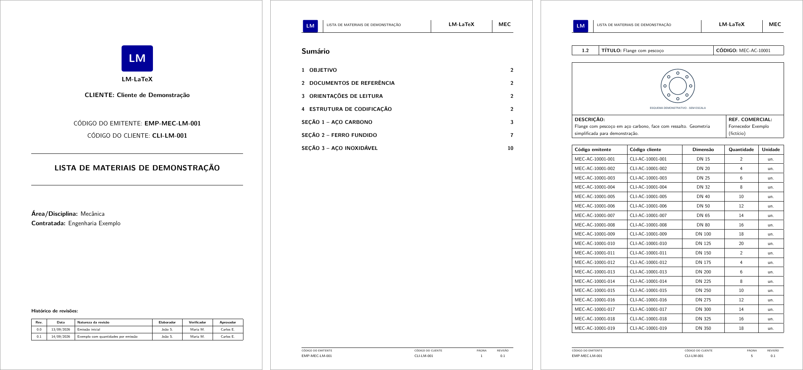

# LaTeX bill of materials (LM-LaTeX)

[Português](README.md) | **English**

Producing a project's bill of materials in Excel is easy: any BIM model or
component database exports a spreadsheet with codes and quantities. The hard
part is turning that spreadsheet into a **well-presented document meant to be
read by people**. This generator does that part. It takes the spreadsheet and
returns a typeset PDF with:

- a cover;
- a navigable table of contents;
- one sheet per component family, with a figure, a description and a table of
  sizes and quantities;
- a revision history.

The generated document is in Portuguese.



[Open the full example PDF](docs/exemplo.pdf)

## The problem

A spreadsheet works for whoever does the calculations, but not for whoever
reads the list: the client, the estimator or the installer. The readable
version, with one sheet per family, used to be put together by hand in Word,
table by table. The work was not hard, but it was long, prone to copy errors
and redone at every scope revision. Changing one quantity meant finding the
sheet, fixing the cell and re-checking pagination, the table of contents and
the numbering.

With the generator, the spreadsheet stays the single source, and the document
is rebuilt for every issue. LaTeX handles the layout, and review effort goes to
the data alone.

## Running

Requires [Anaconda](https://www.anaconda.com/download) or [Miniconda](https://docs.conda.io/projects/miniconda/) and, besides that, a LaTeX distribution with `pdflatex`:
[MiKTeX](https://miktex.org/download) on Windows, or TeX Live. In **Anaconda Prompt**, go to this folder and run:

```bat
conda env create -f environment.yml
conda activate lista-materiais-latex
python main.py
```

The PDF is written to `output/exemplo/main.pdf`. The parameters are at the top
of `main.py`:

- which issue to build;
- output folder;
- whether to write only the `.tex`, without compiling.

## Inputs

| File | Contents |
| --- | --- |
| `DB/data.xlsx`, sheet `Catalogo` | Component register, one row per size, with issuer and client codes. |
| `DB/figs/` | Schematic figures named after the family code (PDF, PNG or JPG). |
| `Emissoes/<name>/itens.xlsx`, sheet `Itens` | Codes and quantities for this issue. |
| `Emissoes/<name>/emissao.json` | Cover, document codes, revision and history. |

For a new issue:

1. Copy the `Emissoes/exemplo` folder.
2. Edit `itens.xlsx` and `emissao.json` in the copy.
3. Point `EMISSAO` in `main.py` to the new JSON.

## Behaviour worth noting

- **Ordering:** the document is grouped by material and, within each material,
  by type in alphabetical order.
- **Pagination:** long tables break across pages and repeat their header.
- **Quantities:**
  - a zero quantity may stay in the spreadsheet, but the item is left out of
    the PDF;
  - fractional quantities use a decimal comma.
- **Error reporting:** unknown or duplicate codes, invalid quantities and
  inconsistent families stop the run and point to the offending row.
- **Missing figure:** the family gets a placeholder image and the problem is
  logged in `avisos.log`.
- **Special characters:** LaTeX special characters (`&`, `%`, `_`…) are escaped
  automatically.
- **Compilation:** `pdflatex` is run until the table of contents and links are
  stable.

## Layout

```text
main.py                       parameters and run
lista_materiais/entrada.py    JSON and spreadsheet loading and validation
lista_materiais/latex.py      LaTeX generation from the template
lista_materiais/compilar.py   pdflatex compilation
Template/                     LaTeX template (layout, cover, TikZ branding)
DB/                           example catalogue and figures
Emissoes/exemplo/             example issue
docs/                         example PDF and preview image
tests/                        automated tests
```

Tests: `python -m unittest discover -s tests -v`. One test compiles a real PDF,
so it needs `pdflatex`.

## Relation to the production tool

This is the public version of a generator I use on projects. The concept is
the same: spreadsheet catalogue, figures, LaTeX template and one compilation
per issue. Three things were changed:

- the data, which is synthetic here: names, codes and brands correspond to
  nothing real;
- the visual identity, redrawn for this repository;
- how an issue is requested: a JSON file here; in the original, a spreadsheet
  fed by the BIM model.

License: [MIT](LICENSE). The PDF uses the Latin Modern Sans font, distributed under
the GUST Font License; openpyxl, pypdf and the LaTeX distribution keep their own licences.
