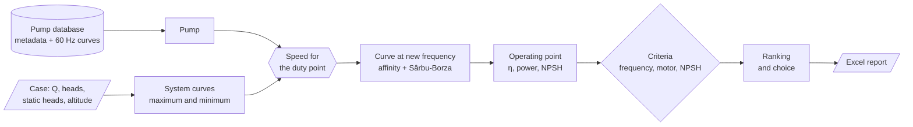

# Pump selector (MK4)

[Português](README.md) | **English**

Centrifugal pump selection for pumping stations with variable-frequency
drives. For each case, the program picks candidate pumps, computes the
operating point at the maximum and minimum system conditions, and checks
frequency, motor margin and NPSH. The result is an Excel report with tables
and charts.

This is the fourth generation of a tool I use for routine preliminary sizing.
The public version runs on a **synthetic database**: manufacturers, models and
curves are fictitious. Code comments and report labels are partly in
Portuguese.

<!-- FIGURE TO PRODUCE: screenshot of the CurvaMax sheet in outputs/Estacao-sintetica-otimizacao.xlsx -->

## Running

Requires [Anaconda](https://www.anaconda.com/download) or [Miniconda](https://docs.conda.io/projects/miniconda/). Open **Anaconda Prompt** from the Start menu, go to
this folder (`cd /d "path\to\this\folder"`) and run the commands below. The
first one is only needed the first time:

```bat
conda env create -f environment.yml
conda activate seletor-bombas
python main.py
```

The parameters are at the top of `main.py`: input files, which case to run,
selection mode and acceptance criteria. Cases are rows in the `Cases` sheet of
`ExampleInputs.xlsx`. Each case produces one report in `outputs/`.

## The three selection modes

| Mode | How candidates are chosen | Typical use |
| --- | --- | --- |
| `manual` | You list exact pump IDs (`ManualIDs` column). The program only computes and reports. | Comparing pumps already shortlisted or proposed by a supplier. |
| `abacus` | Looks up each manufacturer's abacus, a head × flow grid, and takes the pump listed at the cell nearest to the duty point. | Reproducing the first pick an engineer makes from a catalogue chart. |
| `optimize` | Evaluates every pump in the database, discards those that fail the criteria and ranks the rest by lowest electrical power. | Full database sweep. |

The `optimize` mode here is a **generic version**, different from the one used
in production. Each pump is scored by its electrical power at the maximum duty,
with a small penalty for its distance from the best efficiency point (BEP).

## The `Pump` class, in engineering terms

`Pump` is meant to be a **universal object** for the hydraulic analysis of a
pump: every calculation about a unit starts from it. It is a continuous work
in progress. Each project adds new checks to it.

A `Pump` instance represents **one unit** (a unique ID) and holds four things.

**1. Fixed data (metadata).** The datasheet values that do not change with
operation:

- manufacturer and model;
- number of poles, rated speed and base frequency;
- motor power and efficiency;
- minimum submergence and impeller axis level;
- voltage and mass;
- best efficiency point (BEP).

**2. Curves.** The manufacturer's curve at base frequency (60 Hz) is loaded
with the pump and cannot be deleted. Curves at other frequencies are computed
on demand and cached by frequency, so each curve is computed only once even
when several checks use it. Every curve carries flow, head, hydraulic
efficiency and required NPSH.

**3. Calculation tools.**

- **Frequency ↔ speed.** Converts drive frequency to shaft speed and back.
  Motor slip varies with frequency.
- **Affinity laws.** Build the curve at another speed, with r = n₂/n₁:

  ```text
  Q₂    = Q₁ · r
  H₂    = H₁ · r²
  NPSH₂ = NPSH₁ · r²
  η₂    = 1 − (1 − η₁) · (n₁/n₂)^0.1      (Sârbu & Borza, 1998)
  ```

  The Sârbu-Borza efficiency correction tends to **underestimate the
  efficiency drop at low speeds** (Marchi et al., 2012). Results far below
  base frequency deserve a second look.
- **Speed for a duty point.** Finds the speed at which the pump curve passes
  through the requested (Q, H).
- **System-curve intersection.** Solves the exact intersection between the
  pump curve and a system curve that includes static head:
  `H(Q) = Hg + (Href − Hg)·(Q/Qref)²`.
- **Operating point.** For a given duty, computes:
  - frequency, speed and slip;
  - efficiency;
  - shaft power, P = ρ·g·Q·H/η;
  - motor margin and electrical power;
  - available NPSH and its margins against required NPSH.

**4. Operating points.** Each computed point is stored in the pump under a
name (for example "Maximum" and "Minimum"). The report and the checks read
from them.

### Information flow



The path is the same in all three modes. Only **which pumps** enter it
changes.

### Acceptance criteria

The criteria live in `main.py`. The example values are working limits adopted
for this project, **not values from a standard**:

- frequency between 30 and 60 Hz;
- motor margin of at least 5 %;
- NPSHa − NPSHr ≥ 0.6 m and NPSHa/NPSHr ≥ 1.25.

When a manufacturer does not publish NPSHr, the value stays "not reported",
never zero. The pump is then kept with a warning or rejected, according to
`missing_npsh_policy`.

Available NPSH is computed as
`NPSHa = Hatm(altitude) + Hsuc − suction losses − Hvapour`.

## Layout

```text
main.py                     parameters and run
pump_selector/models.py     Pump, curves, system curve, NPSH
pump_selector/selection.py  selection modes and criteria
pump_selector/database.py   database loading and validation
pump_selector/inputs.py     case loading
pump_selector/reporting.py  report filling
pump_selector/workbook_xml.py  writes into the template without losing Excel charts
pump_selector/runner.py     case loop
DB/PumpDatabase.xlsx        synthetic database and abacuses
ExampleInputs.xlsx          three example cases, one per mode
TemplateSaida.xlsx          report template
outputs/                    reports produced by the examples
scripts/                    synthetic database generator
tests/                      automated tests
```

Tests: `python -m unittest discover -s tests -v`

## Disclaimer

A preliminary-sizing tool, published for demonstration. Selecting real
equipment requires certified manufacturer data and a full analysis of the
installation by a qualified engineer.

**References:**

- Sârbu, I.; Borza, I. *Energetic optimization of water pumping in distribution
  systems*. Periodica Polytechnica Mechanical Engineering, 42, 141–152, 1998.
- Marchi, A.; Simpson, A. R.; Ertugrul, N. *Assessing variable speed pump
  efficiency in water distribution systems*. Drinking Water Engineering and
  Science, 5, 15–21, 2012.

License: [MIT](LICENSE).
