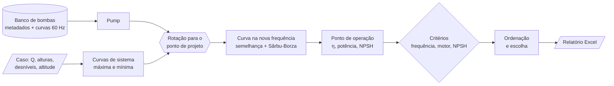

# Seletor de bombas (MK4)

**Português** | [English](README.en.md)

Seleção de bombas centrífugas para estações de bombeamento com inversor de
frequência. Para cada caso, o programa escolhe as bombas candidatas, calcula o
ponto de operação nas condições máxima e mínima do sistema e verifica
frequência, folga do motor e NPSH. O resultado sai em um relatório Excel com
tabelas e gráficos.

É a quarta geração de uma ferramenta que uso na rotina de pré-dimensionamento.
Esta versão pública roda sobre um **banco sintético**: fabricantes, modelos e
curvas são fictícios.

<!-- FIGURA A PRODUZIR: captura da aba CurvaMax de outputs/Estacao-sintetica-otimizacao.xlsx -->

## Executar

Requer o [Anaconda](https://www.anaconda.com/download) ou o [Miniconda](https://docs.conda.io/projects/miniconda/). Abra o **Anaconda Prompt** pelo menu Iniciar,
entre nesta pasta (`cd /d "caminho\desta\pasta"`) e execute os comandos abaixo.
O primeiro só é necessário na primeira vez:

```bat
conda env create -f environment.yml
conda activate seletor-bombas
python main.py
```

Os parâmetros ficam no topo do `main.py`: arquivos de entrada, caso a
processar, modo de seleção e critérios de aceitação. Os casos ficam na aba
`Cases` de `ExampleInputs.xlsx`, uma linha por estação. Cada caso gera um
relatório em `outputs/`.

## Os três modos de seleção

| Modo | Como escolhe as candidatas | Uso típico |
| --- | --- | --- |
| `manual` | Você informa os IDs exatos (coluna `ManualIDs`). O programa só calcula e relata. | Comparar bombas já pré-escolhidas ou indicadas por fornecedor. |
| `abacus` | Consulta o ábaco de cada fabricante, uma grade altura × vazão, e pega a bomba indicada no ponto mais próximo do ponto de projeto. | Reproduzir a primeira escolha que se faz com o ábaco do catálogo. |
| `optimize` | Avalia todas as bombas do banco, descarta as que falham nos critérios e ordena pelo menor consumo elétrico. | Varredura completa do banco. |

O modo `optimize` desta versão é **genérico** e diferente do usado em
produção. Aqui, a nota de cada bomba é a potência elétrica no ponto máximo,
com uma pequena penalidade pela distância ao ponto de melhor eficiência (BEP).

## A classe `Pump`, em termos de engenharia

A classe `Pump` pretende ser um **objeto universal** para as análises
hidráulicas de uma bomba: tudo o que se calcula sobre um equipamento parte
dela. É um trabalho em evolução contínua. A cada projeto, novas verificações
entram nela.

Uma instância de `Pump` representa **um equipamento** (um ID único) e reúne
quatro coisas.

**1. Dados fixos (metadados).** São os dados de folha de dados que não mudam
com a operação:

- fabricante e modelo;
- número de polos, rotação nominal e frequência base;
- potência e rendimento do motor;
- submergência mínima e cota do eixo do rotor;
- tensão e massa;
- ponto de melhor eficiência (BEP).

**2. Curvas.** A curva do fabricante na frequência base (60 Hz) é carregada
junto com a bomba e não pode ser apagada. As curvas em outras frequências são
calculadas sob demanda e guardadas, indexadas pela frequência. Assim, cada
curva é calculada uma única vez, mesmo que várias verificações a usem. Cada
curva tem vazão, altura, rendimento hidráulico e NPSH requerido.

**3. Ferramentas de cálculo.**

- **Frequência ↔ rotação.** Converte a frequência do inversor em rotação do
  eixo e vice-versa. O escorregamento do motor varia com a frequência.
- **Leis de semelhança.** Geram a curva em outra rotação, com r = n₂/n₁:

  ```text
  Q₂    = Q₁ · r
  H₂    = H₁ · r²
  NPSH₂ = NPSH₁ · r²
  η₂    = 1 − (1 − η₁) · (n₁/n₂)^0,1      (Sârbu & Borza, 1998)
  ```

  A correção de rendimento de Sârbu-Borza tende a **subestimar a queda de
  rendimento em rotações baixas** (Marchi et al., 2012). Por isso, resultados
  muito abaixo da frequência base merecem conferência.
- **Rotação para um ponto de projeto.** Encontra a rotação em que a curva da
  bomba passa pelo par (Q, H) pedido.
- **Interseção com a curva do sistema.** Resolve a interseção exata entre a
  curva da bomba e a curva do sistema, que inclui o desnível estático:
  `H(Q) = Hg + (Href − Hg)·(Q/Qref)²`.
- **Ponto de operação.** Dado o ponto, calcula:
  - frequência, rotação e escorregamento;
  - rendimento;
  - potência no eixo, P = ρ·g·Q·H/η;
  - folga do motor e consumo elétrico;
  - NPSH disponível e margens em relação ao NPSH requerido.

**4. Pontos de operação.** Cada ponto calculado fica guardado na bomba com um
nome (por exemplo, "Maximum" e "Minimum"). O relatório e as verificações leem
esses pontos.

### Fluxo de informação



O caminho é o mesmo nos três modos. O que muda é **quais bombas** entram no
fluxo.

### Critérios de aceitação

Os critérios ficam em `main.py`. Os valores de exemplo são limites de trabalho
adotados neste projeto, **não valores normativos**:

- frequência entre 30 e 60 Hz;
- folga mínima de 5 % no motor;
- NPSHd − NPSHr ≥ 0,6 m e NPSHd/NPSHr ≥ 1,25.

Quando o fabricante não informa o NPSHr, o valor fica como "não informado",
nunca como zero. Nesse caso, a bomba segue com aviso ou é rejeitada, conforme
a opção `missing_npsh_policy`.

O NPSH disponível é calculado como
`NPSHd = Hatm(altitude) + Hsuc − perdas na sucção − Hvapor`.

## Estrutura

```text
main.py                     parâmetros e execução
pump_selector/models.py     Pump, curvas, curva de sistema, NPSH
pump_selector/selection.py  modos de seleção e critérios
pump_selector/database.py   leitura e validação do banco
pump_selector/inputs.py     leitura dos casos
pump_selector/reporting.py  preenchimento do relatório
pump_selector/workbook_xml.py  grava no template sem perder os gráficos do Excel
pump_selector/runner.py     laço dos casos
DB/PumpDatabase.xlsx        banco e ábacos sintéticos
ExampleInputs.xlsx          três casos de exemplo, um por modo
TemplateSaida.xlsx          modelo do relatório
outputs/                    relatórios gerados pelos exemplos
scripts/                    gerador do banco sintético
tests/                      testes automatizados
```

Testes: `python -m unittest discover -s tests -v`

## Aviso

Ferramenta de pré-dimensionamento, publicada para demonstração. A seleção de um
equipamento real exige os dados certificados do fabricante e a análise
completa da instalação por profissional habilitado.

**Referências:**

- Sârbu, I.; Borza, I. *Energetic optimization of water pumping in distribution
  systems*. Periodica Polytechnica Mechanical Engineering, 42, 141–152, 1998.
- Marchi, A.; Simpson, A. R.; Ertugrul, N. *Assessing variable speed pump
  efficiency in water distribution systems*. Drinking Water Engineering and
  Science, 5, 15–21, 2012.

Licença: [MIT](LICENSE).
